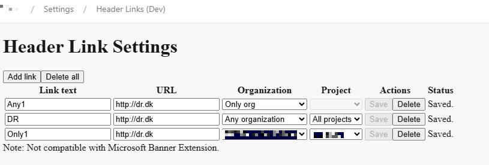
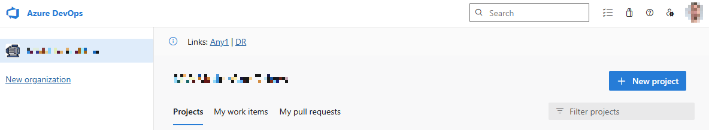

Header Link Settings provides a settings pane under Organization Settings that lets administrators define reusable links. Links are rendered as a non-dismissable banner and can change based on the current organization and project URL.

**Settings:**

**Resulting page:**

### Features

- Render a clickable "Links: ..." banner across all pages.
- Configure link text and URL from a settings hub.
- Filter links by organization and project based on the current URL.

### Current behavior and limitations

- Links are displayed alphabetically by link text.
- Banner rendering uses the global message service and updates on navigation.
- Not compatible with Microsoft Banner Extension!

### Setup and development

See [SETUP.md](SETUP.md) for build, packaging, publishing, and debugging steps.

### Installing and using

1) Install the generated `.vsix` in your Azure DevOps organization (Organization settings -> Extensions -> Browse marketplace -> Manage extensions -> Upload).
2) Enable the extension for your organization.
3) Open Organization settings -> Header Links.
4) Add links with text, URL, organization, and project filters.

